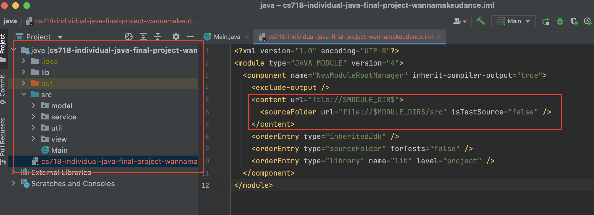

# Admin Platform of Blogging System

## Structure Introduction

```
cs718-individual-java-final-project-wannamakeudance
├─ .gitignore
├─ README.md
├─ cs718-individual-java-final-project-wannamakeudance.iml
|
├─ java                        // The Admin Platform made in Java Swing 
│  ├─ lib
│  │  ├─ jackson-annotations-2.12.3.jar
│  │  ├─ jackson-core-2.12.3.jar
│  │  ├─ jackson-databind-2.12.3.jar
│  │  └─ jackson-datatype-jsr310-2.12.3.jar
│  └─ src
│     ├─ Main.java
│     ├─ model                 // The model class of user
│     │  └─ User.java
│     ├─ service               // Handle HttpRequest and HttpClient
│     │  └─ API.java
│     ├─ util                  // The common const variables and utils
│     │  ├─ Const.java
│     │  └─ JSONUtils.java
│     └─ view                  // Swing UI components  
│        ├─ AdminPlatform.java
│        ├─ DialogAdaptor.java
|
└─ nodejs                       // The Bloggging System made in node
   ├─ README.md
   ├─ app.js
   ├─ middleware
   ├─ modules
   │  ├─ analytics-dao.js
   │  ├─ ...
   ├─ package.json
   ├─ public
   │  ├─ css
   │  ├─ images
   │  └─ js
   ├─ routes                    // the APIs for these two platforms 
   │  ├─ API.js
   │  ├─ ...
   ├─ sql                       // SQL to initialize the database
   ├─ utils
   │  └─ index.js
   └─ views
```

## Start

### Initialize the nodejs parts
#### 1. Open the current project and execute the following commands.

> cd nodejs/
> 
> npm install

#### 2. Initialize the database

Delete the `./nodejs/project-database.db` file if it exists.

Create database named `project-database.db` in `./nodejs/` directly.

Copy the SQL in `./nodejs/sql/project-database-init-script.sql`and execute them.

Hint: remember to write to file at last and make the database effective.

#### 3. Start server for APIs

> cd nodejs/
>
> node app.js

If you want to see the website of Blogging system, you can visit `http://localhost:3000/` in the browser.

### Initialize the java part

#### 1. Open the project in IntelliJ like this:



#### 2. Configure the project structure

- JDK 17
- Library import `./java/lib/**`(jackson libraries)

#### 3. Open the Admin Platform

Run `./java/src/Main.java` and you can see the admin UI.


#### 4. The Admin User Information

> username: user1
> 
> password: 12