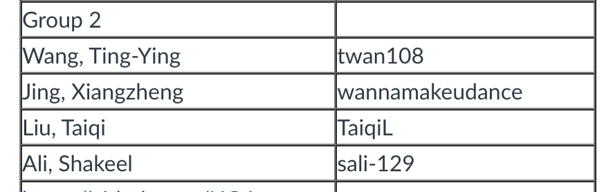

Final project &ndash; A Nature Protection blogging system &ndash; 
==========

## Team name and contributors

## Start

### 1. initialize database

Delete the current `project-database.db` file;

Copy sql script in the file named `/sql/project-database-init-script.sql` to created tables and insert default data.

Hint: please make sure the db name "project-database.db" and locate in the root of the current project.

### 2. install the dependencies in the package.json

> npm intall

### 3. start server

> node app.js

## Existed data

account: "user1"

password: "12"

articles: 4 articles and 4 comments created by user1, you can see them when you open localhost:3000/
